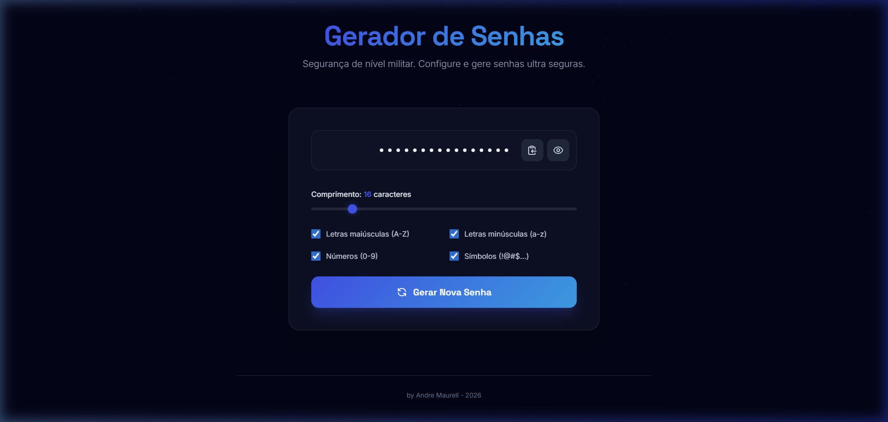
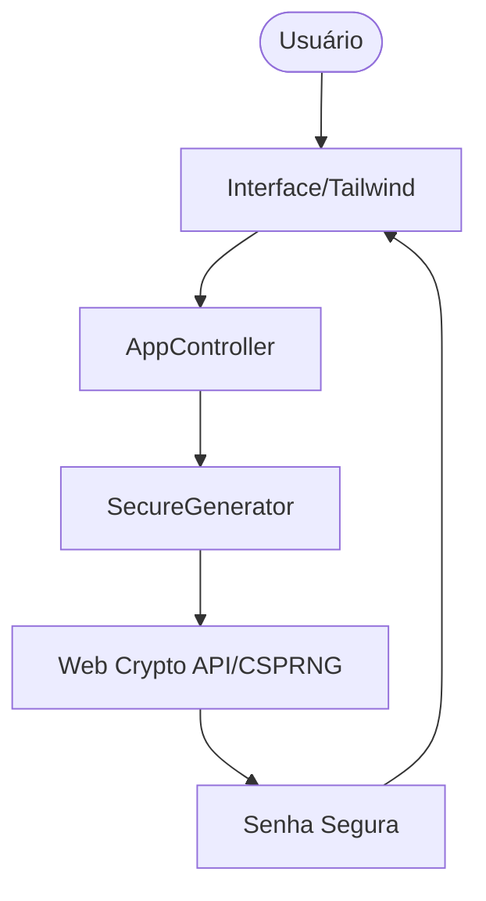

# 🔐 Gera Senhas - Premium Password Generator

[Português](#português) | [English](#english)

---

## 🇧🇷 Português

### 📋 Sobre o Projeto
O **Gera Senhas** é uma aplicação web de alta performance voltada para a geração de senhas criptograficamente seguras. Desenvolvido sob os pilares da **Privacidade por Design (LGPD)** e **Segurança Ofensiva (OWASP)**, o projeto utiliza algoritmos de alta entropia para garantir a proteção máxima dos dados do usuário.

### 🎯 Funcionalidades
- **Geração CSPRNG**: Utiliza `window.crypto` para aleatoriedade de nível militar.
- **Customização Total**: Controle de comprimento (8-64 caracteres) e tipos de caracteres (Maiúsculas, Minúsculas, Números, Símbolos).
- **Interface Premium**: Design Neo-Noir com glassmorphism e animações fluidas.
- **Arte Algorítmica**: Fundo dinâmico com Flow Field em p5.js.
- **Privacidade Total**: Processamento 100% local, sem persistência ou transmissão de dados.

### 🏗️ Arquitetura Técnica (POO & SOLID)
O projeto segue uma estrutura moderna de Programação Orientada a Objetos:

- **`SecureGenerator`**: Responsável pela lógica matemática e segurança.
- **`AppController`**: Gerencia o estado da UI e eventos do DOM.
- **`VisualSymphony`**: Motor gráfico em p5.js para ambientação.

#### 📊 Fluxo de Dados

### 🛡️ Segurança (OWASP & LGPD)
| Princípio | Implementação |
|-----------|---------------|
| **Criptografia** | Uso de `Uint32Array` e `getRandomValues` para evitar previsibilidade. |
| **Privacidade** | Em conformidade com a LGPD: zero coleta de dados pessoais. |
| **XSS Prevention**| Sanitização e neutralização de entradas via DOM API. |
| **Shoulder Surfing**| Sistema de máscara visual (Show/Hide) para proteção física. |

### 🚀 Como Executar
Devido ao uso de recursos modernos de hardware (Web Crypto API) e scripts externos (p5.js), recomenda-se o uso de um servidor local:
1. Navegue até a pasta `projetos/gera_senhas/`.
2. Abra o arquivo `index.html` com a extensão **Live Server** no VS Code ou qualquer servidor HTTP de sua preferência.

---

## 🇺🇸 English

### 📋 About the Project
**Gera Senhas** is a high-performance web application designed for generating cryptographically secure passwords. Built upon the pillars of **Privacy by Design (GDPR/LGPD)** and **Offensive Security (OWASP)**, the project employs high-entropy algorithms to ensure maximum user data protection.

### 🎯 Features
- **CSPRNG Generation**: Uses `window.crypto` for military-grade randomness.
- **Total Customization**: Control over length (8-64 characters) and character types.
- **Premium Interface**: Neo-Noir design with glassmorphism and fluid animations.
- **Algorithmic Art**: Dynamic p5.js background featuring a Flow Field.
- **Zero-Trust Privacy**: 100% local processing; no data is stored or transmitted.

### 🏗️ Technical Architecture
- **`SecureGenerator`**: Handles mathematical logic and security protocols.
- **`AppController`**: Manages UI state and DOM events.
- **`VisualSymphony`**: p5.js graphics engine for atmospheric depth.

### 🛡️ Security & Compliance
- **Cryptography**: Employs `window.crypto.getRandomValues()` to eliminate bias.
- **Privacy**: Fully GDPR/LGPD compliant; zero personal data collection.
- **Physical Safety**: Built-in mask system (Show/Hide) to prevent visual intrusion.

---
*Developed by Andre Maurell - 2026*
